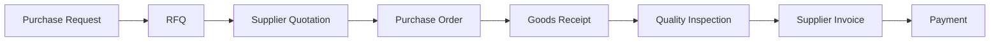
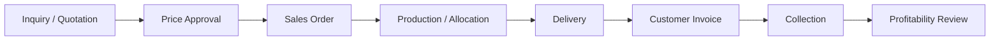
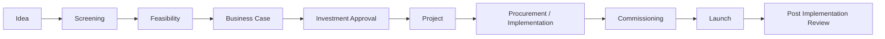

# ERD و نقشه روابط داده‌ای سامانه

این فایل نسخه تصویری/متنی مدل داده را برای استفاده در Markdown Viewer، Mermaid و ابزارهای طراحی معماری ارائه می‌کند.

---

## 1) ERD سطح کلان

```mermaid
erDiagram
    DEPARTMENTS ||--o{ USERS : has
    USERS ||--o{ USER_ROLES : assigned
    ROLES ||--o{ USER_ROLES : grants
    ROLES ||--o{ ROLE_PERMISSIONS : maps
    PERMISSIONS ||--o{ ROLE_PERMISSIONS : includes

    WORKFLOW_DEFINITIONS ||--o{ WORKFLOW_STATES : defines
    WORKFLOW_DEFINITIONS ||--o{ WORKFLOW_TRANSITIONS : controls
    WORKFLOW_DEFINITIONS ||--o{ WORKFLOW_INSTANCES : instantiates
    WORKFLOW_INSTANCES ||--o{ WORKFLOW_TASKS : contains
    WORKFLOW_TASKS ||--o{ APPROVALS : results_in

    SUPPLIERS ||--o{ SUPPLIER_QUOTATIONS : submits
    SUPPLIERS ||--o{ PURCHASE_ORDERS : receives
    CUSTOMERS ||--o{ SALES_ORDERS : places
    CUSTOMERS ||--o{ CUSTOMER_INVOICES : billed

    PRODUCTS ||--o{ BOM_HEADERS : has
    BOM_HEADERS ||--o{ BOM_ITEMS : contains
    MATERIALS ||--o{ BOM_ITEMS : component

    PURCHASE_REQUESTS ||--o{ PURCHASE_REQUEST_LINES : has
    PURCHASE_REQUESTS ||--o{ RFQS : triggers
    RFQS ||--o{ RFQ_SUPPLIERS : invites
    RFQS ||--o{ SUPPLIER_QUOTATIONS : receives
    SUPPLIER_QUOTATIONS ||--o{ SUPPLIER_QUOTATION_LINES : contains
    PURCHASE_REQUESTS ||--o{ PURCHASE_ORDERS : converts_to
    SUPPLIER_QUOTATIONS ||--o{ PURCHASE_ORDERS : selected_for
    PURCHASE_ORDERS ||--o{ PURCHASE_ORDER_LINES : contains
    PURCHASE_ORDERS ||--o{ GOODS_RECEIPTS : received_by
    GOODS_RECEIPTS ||--o{ GOODS_RECEIPT_LINES : contains
    GOODS_RECEIPTS ||--o{ QUALITY_INSPECTIONS : inspected_by
    QUALITY_INSPECTIONS ||--o{ QUALITY_INSPECTION_LINES : details
    PURCHASE_ORDERS ||--o{ SUPPLIER_INVOICES : referenced_by
    GOODS_RECEIPTS ||--o{ SUPPLIER_INVOICES : matched_to
    SUPPLIER_INVOICES ||--o{ PAYMENTS : settled_by

    PRODUCTS ||--o{ PRODUCTION_ORDERS : manufactured_by
    PRODUCTION_ORDERS ||--o{ COST_SHEETS : costed_by
    PRODUCTS ||--o{ COST_SHEETS : cost_basis
    PRODUCTS ||--o{ PRICE_LISTS : priced_by
    CUSTOMERS ||--o{ PRICE_LISTS : negotiated_for

    SALES_ORDERS ||--o{ SALES_ORDER_LINES : contains
    SALES_ORDERS ||--o{ DELIVERIES : fulfilled_by
    DELIVERIES ||--o{ DELIVERY_LINES : details
    SALES_ORDERS ||--o{ CUSTOMER_INVOICES : invoiced_by
    CUSTOMER_INVOICES ||--o{ COLLECTIONS : collected_by

    PROJECTS ||--o{ PROJECT_MILESTONES : schedules
    PROJECTS ||--o{ CHANGE_REQUESTS : changes

    WORKFLOW_INSTANCES ||--o{ ALERTS : raises
    USERS ||--o{ AUDIT_LOGS : performs
    ROLES ||--o{ KPI_DEFINITIONS : owns
    KPI_DEFINITIONS ||--o{ KPI_SNAPSHOTS : tracks
```

---

## 2) Traceability Graph — Source to Pay

## 3) Traceability Graph — Order to Cash

## 4) Traceability Graph — Idea to Value

---

## 5) View Materialization پیشنهادشده برای پاسخ سریع مدیریتی

برای اینکه مدیرعامل در چند ثانیه بداند «این پرونده الان دست چه کسی است و چرا متوقف شده»، یک View یا Read Model تجمیعی پیشنهاد می‌شود:

### `vw_workflow_case_summary`
فیلدهای پیشنهادی:
- process_name
- object_type
- object_code
- current_state
- current_owner_user
- current_owner_role
- current_due_at
- overdue_days
- hold_reason
- block_reason
- next_action
- escalation_level
- linked_document_count
- financial_impact
- last_action_at
- last_action_by

### `vw_procurement_traceability`
- pr_code
- rfq_code
- quotation_count
- selected_supplier
- po_code
- grn_code
- qc_result
- invoice_code
- payment_code
- open_exception_count
- open_alert_count

### `vw_sales_profitability`
- so_code
- customer_code
- selling_amount
- actual_cost
- planned_margin
- actual_margin
- collected_amount
- overdue_receivable

---

## 6) نکته اجرایی

Mermaid بالا برای مستندسازی و مرور طراحی است. منبع معتبر اجرایی برای پیاده‌سازی دیتابیس همچنان فایل زیر است:

- `docs/database_schema.sql`
